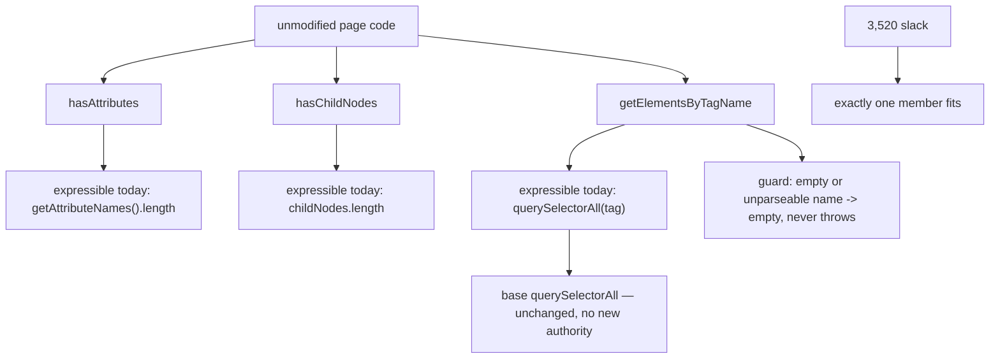

# The smallest main-only method that fits — read-only audit, 0.0.1

Design-only. Nothing implemented, no court frozen, the handle does not widen,
no cap or floor proposed or moved, no navigation, visual or surface path run.
Throwaway builds carried every price and went away with their worktree. The
frozen `getElementsByClassName` court stays on **hold** and that method is not
implemented. `setInterval` is untouched.

Every number below was measured for **the actual member**, built and run. The
previous round's mistake was extrapolating one probe's price onto a different
member; this audit does not do that anywhere.

## 1. What fits, measured one member at a time

All against the shipped `da8cafa` line at 62,016 of the 65,536 bound:

| candidate | shape | slack | delta | left | fits |
| --- | --- | --- | --- | --- | --- |
| `hasAttributes()` | one line | 62,480 | **+464** | 3,056 | **yes** |
| `hasChildNodes()` | one line | 62,480 | **+464** | 3,056 | **yes** |
| `getElementsByTagName(name)` | one line | 62,512 | +496 | 3,024 | yes |
| **`getElementsByTagName(name)`, guarded** | one line plus `try`/`catch` | 62,592 | **+576** | **2,944** | **yes** |
| any **two** of them | — | 67,072 | +5,056 | −1,536 | **no** |
| all **three** | — | 67,536 | +5,520 | −2,000 | **no** |

**Exactly one member fits, whichever it is.** The second crosses the
allocation block and costs about 4,600 more, which is the same wall
`getElementsByClassName` hit — except that this time the wall is between the
first member and the second rather than inside the first.

The guard is the difference that mattered last round, so it was priced here
rather than assumed: on `getElementsByClassName` the token-joining body plus
the guard cost 5,024 and failed; on `getElementsByTagName` the same guard
costs 80 bytes and fits, because the body is a single delegation.

## 2. What the candidates actually are

```
   page calls                     this host today
   ------------------------------ ---------------------------------
   el.hasAttributes()             el.getAttributeNames().length > 0
   el.hasChildNodes()             el.childNodes.length > 0
   el.getElementsByTagName(t)     el.querySelectorAll(t)
                                          |
                                          v
                        Node.prototype.querySelectorAll  (base)
                                          |
                        parseSelector + __descendants + matchChain
```



**None of the three unlocks a capability.** Each is expressible with what a
page already has, so the value is **compatibility with page code nobody is
going to rewrite** — a legacy script that calls `getElementsByTagName` fails
today at the call, not at the concept.

By that measure the ranking is not close: `getElementsByTagName` is what real
pages call, `hasChildNodes` is occasionally used, and `hasAttributes` is rare
enough that its main argument is cheapness.

## 3. `getElementsByTagName`, measured on a build

| behaviour | measured | standard |
| --- | --- | --- |
| document scope, document order | `outside,first,second,…` | same |
| element scope, descendants only | `first,second` | same |
| the element itself is excluded | `includes self false` | same |
| case-insensitive for HTML | `'P'` finds the same as `'p'` | same |
| `'*'` | matches everything, count equal to `querySelectorAll('*')` | same |
| empty argument | `length 0`, no throw | same |
| a name the engine cannot parse, `'a:b'` | `length 0`, no throw | a browser would match the literal name |
| no match | `0` | same |
| result type | plain array | live `HTMLCollection` |
| liveness | `held 15 \| still 15 \| fresh 16` | a live collection would say 16 |
| detached subtree | `found 1` | same |
| inside a dispatch | `ran 1 \| unchanged true` | same |

## 4. Authority, reentrancy, lifecycle, child divergence

- **Authority: none added.** It calls the base's `querySelectorAll`, which a
  page can already call directly. No listener runs, no event is minted, no
  host state is read or written.
- **Reentrancy: none.** Measured inside a dispatch: the listener ran once and
  the answer did not change. It holds nothing across calls.
- **Lifecycle: none.** It allocates one array per call and owns nothing after
  it returns; there is no timer, no signal, no registration.
- **Child divergence: unchanged and unchangeable here.** The member lives in
  the main extension, so a child realm does not get it and could not use it —
  children run no scripts. M1 and M2 do not move.
- **The handle does not widen** and the base is untouched, so the frozen
  exact-key-set criterion is unaffected.

## 5. Loss matrix

| the page expects | after `getElementsByTagName` | note |
| --- | --- | --- |
| the method exists on elements and the document | **served** by one member on `Node` | `Element` and `Document` both extend it |
| descendants in document order | **served** | |
| case-insensitive HTML matching | **served** | the engine lowercases tag names already |
| `'*'` | **served** | |
| never throws | **served** by the guard, at 80 bytes | |
| a **live** `HTMLCollection` | **not served** — a plain array | inherited from `querySelectorAll`, already recorded |
| `getElementsByTagNameNS`, namespace-qualified names | **not served** | this host has no namespace model |
| a name with a colon or other unparseable text | **not served** — empty result | new recorded loss; a browser matches the literal name |
| `hasChildNodes`, `hasAttributes` | **not served** | they do not fit alongside it |

## 6. Candidates and pending rulings

1. **Take `getElementsByTagName`, guarded, at +576** — the highest
   compatibility value of the three, measured at 2,944 bytes of slack left,
   with no authority, reentrancy or lifecycle question and no child cost.
2. **Or take `hasChildNodes` at +464** if the reserve matters more than the
   compatibility; it has no error surface at all, so it needs no guard and no
   loss row.
3. **Or take none**, keeping 3,520. After this slice the reserve is under
   3,000 either way, and the next member of any kind costs about 4,600.
4. **Not proposed here**: `hasAttributes`, which is real but rarely called;
   the two that do not fit alongside a choice; and anything that would need
   the bound moved, a capability traded, or the handle widened.

Whatever is taken, the court for it should pin what §3 measured — including
the two losses — because both are the kind a page discovers as a wrong answer
rather than an error.
