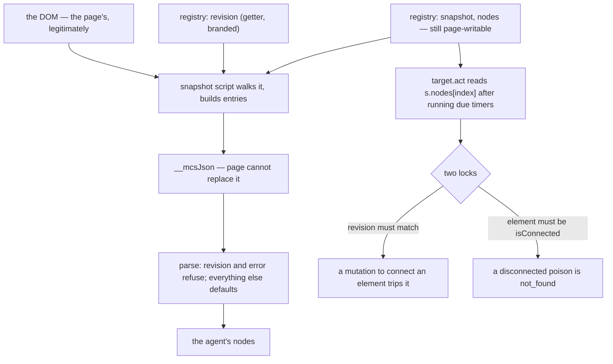

# Snapshot defaulting — design-only audit, 0.0.1

Read-only and design-only, from `ed9169e`. No product code changed, no court
frozen, no handle, base or bound changed, no visual run, no navigation soak, no
download. Every probe is a hermetic local fixture.

**Finding: the defaults are hygiene, not a hole. Every page-reachable path
through them ends in a refusal — and one of those refusals is mislabelled.**

## 1. What the two parse sites do, field by field

| field | `main.rs:3003` (painter) | `main.rs:6786` (snapshot) | on absence or wrong type |
| --- | --- | --- | --- |
| `error` | — | any value refuses | `internal`, *target lost its revision instrumentation* — **fail closed** |
| `revision` | required `u64` | required `u64` | `internal`, *snapshot lacks a revision* — **fail closed** |
| `truncated` | — | `as_bool` | silently **false** |
| `nodes` | `as_array` | `as_array` | silently **empty** |
| `nodes[].node` | `as_str` | `as_str` | silently **`"node_0"`** |
| `nodes[].role` / `.name` | `as_str` | cloned | silently **`""`** / **`null`** |
| `nodes[].*` extras | ignored | ignored | silently dropped |

Two fields are required and refuse. Everything else defaults in silence, and
`node_0` is the worst of them: a reference id invented by the parser rather than
by the realm.

## 2. Why almost none of that is reachable

After H1 the answer is serialised by `__mcsJson`, which a page cannot replace,
over values the **host's own script** builds by walking the DOM. A page controls
the DOM — that is legitimate and is what a snapshot is for — but it does not
choose the field names, the types, or the count, which `max_nodes` and
`MAX_SNAPSHOT_NODES` bound.

What remains page-writable is the registry object itself. The brand made
`window.__mcs` non-writable and its `revision` a getter with no setter, but
`snapshot` and `nodes` are still ordinary data properties on an object the page
can reach.

## 3. What a page can actually do to it, measured

`target.act` runs due timers **before** it resolves the node index, so a page
timer gets to run in exactly the window between the agent's snapshot and its
act. Each row is one timer, fired in that window:

| the timer does | the act answers | the server received |
| --- | --- | --- |
| replaces every `nodes[i]` with a **disconnected** anchor to `/evil.html` | **`not_found`** | nothing |
| appends that anchor first, so it is **connected**, then replaces `nodes[i]` | **`stale_revision`** | nothing |
| sets `snapshot` to a number that matches nothing | **`not_found`** | nothing |
| sets `nodes` to `null` | **`internal`** | nothing |

**The interlock is what saves it**, and it is worth stating plainly: an act
needs a revision that still matches *and* an element that is connected.
Connecting an element is a DOM mutation, and a DOM mutation advances the
branded counter — so the two conditions cannot both be met by a page. The
registry's remaining writable fields buy a denial, never a redirection.

The audit's earlier attack was different in kind: it owned the counter, so the
first lock never engaged. That is closed.

## 4. The one blemish

`nodes = null` answers **`internal`**. Nothing was wrong with the host: a page
set a field to null and the script threw. `internal` says "the host broke",
which is exactly the confusion the download work took care to avoid. The other
three answer `not_found` and `stale_revision`, which are accurate.

This is a typed-answer question, not a security one — the behaviour is already
fail-closed.

## 5. Candidates

| candidate | what it buys | measured cost | verdict |
| --- | --- | --- | --- |
| **A. Strict parse** — a typed refusal instead of silent defaults, and never invent `node_0` | defence in depth against a future path that lets a page influence the JSON | host-side only; **0 per realm** | **Recommended.** It is unreachable today, which makes it cheap insurance rather than a fix. |
| **B. Brand `snapshot` and `nodes` too** — accessors with brand-checked setters, as `revision` has | closes the tampering at the source instead of relying on the interlock | **+1,872 bytes per realm**, measured against a registry of today's shape (+944 → +2,816) | **Not recommended on its own.** It pays 1.9 KB in every realm to convert a denial into a slightly earlier denial. Worth revisiting only if the interlock is ever weakened. |
| **C. Relabel the null case** | a page-caused fault stops reading as a host fault | 0 | **Recommended**, and small: it belongs with A. |
| D. Do nothing | — | 0 | Defensible: every path already fails closed. The argument against is §4 and the `node_0` default. |

## 6. Owners, invariants, evidence, safe failure

- **Owner**: the answer's shape is the host's script; the registry's fields are
  the host's object, with two of them still page-writable.
- **Invariants**: a reference resolves to the node the agent read, or the act is
  refused; the agent's node list is the host's; a refusal names what went wrong.
- **Evidence**: §1 read from both parse sites; §3 measured, four timers, the
  server's request log as witness.
- **Safe failure**: present on every measured path. The gap is naming, not
  direction.

## 7. Loss matrix

| | do nothing | A + C | B |
| --- | --- | --- | --- |
| a page can redirect an act | no | no | no |
| a page can deny its own act | yes | yes | **still yes** — it can always mutate |
| a malformed answer is refused rather than defaulted | no | **yes** | no |
| `node_0` can be invented by the parser | yes | **no** | yes |
| a page-caused fault reads as a host fault | **yes** | no | yes |
| per-realm cost | none | **none** | **+1,872 bytes** |

## 8. Dependencies and non-goals

- **Dependencies**: none frozen. A and C touch two parse sites and one error
  mapping; no bound, handle key, protocol field or shim.
- **Regressions verified unchanged by this audit** (no code touched):
  registry-brand **15/15**, host-answer **9/9**, probe-truthfulness **25/25**.
- **Non-goals**: H2; the 71 uncapturable sites; changing the node model or
  `max_nodes`; making a shared realm hostile-page-proof.

## 9. Court draft

1. A snapshot answer missing `nodes` is refused, not treated as an empty page.
2. An entry without a `node` id is refused; the parser never invents `node_0`.
3. An entry whose `role` or `name` is not a string is refused, not blanked.
4. `truncated` that is not a boolean is refused, not read as false.
5. A page that replaces `nodes` with a disconnected element gets `not_found`; a
   page that connects one gets `stale_revision`; the server receives neither.
6. A page that sets `nodes` to null gets a refusal that does **not** read as a
   host fault.
7. The agent's snapshot still carries the real document in all of the above.
8. Per-realm tracked bytes are unchanged: A and C are host-side only.

## 10. Pending rulings

1. Whether **A + C** proceed together — recommended, at no per-realm cost.
2. Whether **B**'s 1,872 bytes per realm are worth buying an earlier denial —
   recommended **not**, on the measurement.
3. Whether the `node_0` default is worth its own note in the protocol
   documentation, since it is the one place the host invents an identifier.
