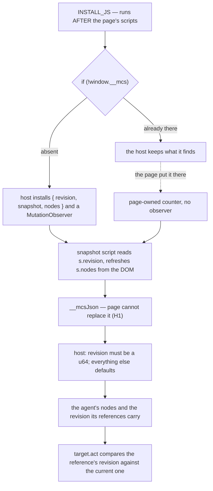

# Snapshot validation — design-only audit, 0.0.1

Read-only and design-only, from `a229c13`. Nothing implemented, no court
frozen, no handle, base or bound changed, no visual run, no navigation soak, no
download. Every probe is a hermetic local fixture.

**The shape check is not the weak point. The provenance of the instrumentation
object is** — and it is exploitable end to end: a page can make the agent
navigate somewhere the agent never chose.

## 1. What the host validates today

The snapshot answer is parsed in two places (`main.rs:3003`, `main.rs:6786`)
and the whole of the validation is:

- `revision` must be present and a `u64`, else `internal: "snapshot lacks a
  revision"`;
- an `error` field means `internal: "target lost its revision instrumentation"`;
- `nodes` is read with `as_array().unwrap_or_default()`, and every field inside
  each entry with `unwrap_or("node_0")`, `unwrap_or("")`, `unwrap_or(false)`;
- `truncated` is `as_bool().unwrap_or(false)`.

So a missing or mistyped field is silently defaulted, and only the revision is
required. After H1, though, the JSON itself is produced by `__mcsJson`, which a
page cannot replace — so the *serialiser* is trustworthy. The question is what
the script serialises.

## 2. Where the answer comes from

Two facts decide everything below, and both were measured:

1. **`window.__mcs` is `undefined` while the page's own scripts run.** The
   install happens after `__mcsComplete()`, so a page script runs first.
2. **`INSTALL_JS` keeps whatever it finds** — `if (!window.__mcs)` — and it is
   a plain assignment, not a defined property. The guard exists because the
   install runs again on the lifecycle path, and it cannot tell the host's
   object from a page's.

A page therefore only has to name the global first.

## 3. What that is worth to an attacker, measured

A page defines `window.__mcs` with a `revision` getter that always returns 0,
then swaps a link when a button is clicked:

| | honest instrumentation | page owns `__mcs` |
| --- | --- | --- |
| revision after the swap | 0 → **1** | 0 → **0** |
| the agent's stale reference | refused **`stale_revision`** | **accepted, `applied: true`** |
| what the click reached | nothing | the **swapped** element |
| the server received | nothing | **`GET /evil.html`** |

The agent held a reference to a link it had read as *"safe link"*, acted on it,
and navigated to an address chosen by the page after the agent looked. **The
staleness protection is the only thing standing between an agent and a
swapped-out node, and it rests on a counter the page can own.**

No observer is installed in that case either, so nothing else advances the
number.

## 4. What is *not* forgeable, and why it matters to the design

- **The node list.** Pre-defining `__mcs` with empty `nodes` changed nothing:
  the snapshot script rebuilds the registry from the DOM on every call, so
  `s.nodes` is an output, not an input. `target.act` then indexes the array the
  host has just refreshed.
- **The serialisation.** H1 closed it; a replaced `JSON.stringify` no longer
  reaches this path.
- **Types and counts.** After H1 the JSON is built by the host's serialiser over
  host-built objects; `max_nodes` and `MAX_SNAPSHOT_NODES` bound the count, and
  `truncated` is computed by the script rather than supplied.

That is why the answer is not "validate the shape harder": the shape is already
the host's own. **The one field the page can choose is the one the host trusts
most.**

## 5. Owners, invariants, evidence, safe failure

- **Owner**: the revision counter is owned by the realm's instrumentation, which
  is *supposed* to be the host's. Today ownership is decided by whoever names
  the global first.
- **Invariant at stake**: a node reference means the same node it meant when the
  agent read it, or the act is refused.
- **Evidence**: §3, one hermetic page, two runs, the server's request log as the
  witness.
- **Safe failure today**: none on this path — the act was *allowed*. Every other
  tampering measured in earlier audits failed closed; this one fails **open**,
  which is what distinguishes it from the H2 findings.

## 6. Candidates

| candidate | what it changes | cost | verdict |
| --- | --- | --- | --- |
| **A. Brand the registry** — install `{brand: <host-minted token>, …}` as a non-writable, non-configurable, non-enumerable property; every reader verifies the brand, and a mismatch refuses the realm | `INSTALL_JS`, the revision and snapshot scripts, a token per realm | host scripts are compiled per call, so ~0 per realm; the object gains one string field | **Recommended.** The host already mints per-realm capabilities for dispatch and lifecycle; this is the same pattern applied to the registry, and it fails closed. |
| B. Install before page scripts, non-configurable | ordering, plus the observer attached later | ~0 | Good, and complementary; but the observer needs `documentElement`, so it splits the install in two, and a second install still needs to recognise its own object — which is A. |
| C. Refuse if the name is already taken | one line | ~0 | Simplest, but the lifecycle path installs a second time, so "already taken" cannot be distinguished from "mine" without A's brand. |
| D. Derive the revision host-side | — | — | Not possible: the DOM lives in the realm, and the host has no independent view of its mutations. |
| E. Harder shape validation of the answer | the two parse sites | small | **Does not address this**: the shape is already the host's own. Worth doing for defaulting hygiene, not for this defect. |

## 7. Loss matrix

| | do nothing | A (brand) | E (schema only) |
| --- | --- | --- | --- |
| a page can own the revision | **yes** | no | **yes** |
| a stale reference can act on a swapped node | **yes, measured** | no | **yes** |
| failure direction | **open** | closed | open |
| per-realm cost | none | ~one string field | none |
| touches the protocol | no | no | possibly |
| touches `SEAL_JS`, handle, base, bounds | no | no | no |

## 8. Dependencies and non-goals

- **Dependencies**: none frozen. A brand changes no bound, no handle key, no
  protocol field, and no shim; it lives in the host's own scripts.
- **Regressions verified unchanged by this audit** (no code was touched):
  host-answer **9/9**, capture-declaration **8/8**, probe-truthfulness
  **25/25**.
- **Non-goals**: H2; changing the snapshot's node model; making a shared realm
  hostile-page-proof; any byte target.

## 9. Court draft

1. A page that defines `window.__mcs` before the host does cannot make the host
   adopt it: the realm is refused, or the host's own registry wins.
2. With such a page, a reference taken before a DOM swap is refused
   `stale_revision` exactly as it is with an honest page.
3. The server receives no request the agent did not ask for, in either case.
4. The revision the agent sees advances when the DOM changes, whatever the page
   has defined.
5. The lifecycle path's second install still finds its own registry and does not
   reset the counter.
6. Nothing in this changes the snapshot's node model, the handle key set, or any
   bound; per-realm tracked bytes are recorded before and after.

## 10. Pending rulings

1. Whether candidate **A** proceeds — freeze a court first, as with H1.
2. Whether the defaulting hygiene of §1 (silent `unwrap_or` on every field) is
   worth a separate, smaller round; it is not what makes §3 possible.
3. Whether this finding changes the standing of the earlier "everything fails
   closed" conclusion. It should: that conclusion was measured over intrinsic
   replacement, and this defect is reached by naming a global instead.

---

## 11. Frozen, then implemented — 2026-09-06

`registry-brand-court.py` was frozen first, receipt
`evidence/native-dom-control-0.0.2-registry-brand.json`. On the shipped binary
it read **10/15**: the honest page passed, and the failures were the page that
names `__mcs` first — no revision advance, a stale reference **accepted**, and
`/evil.html` in the server's log — plus the two source rules.

It now reads **15/15** on `ce371f78…`.

### What the registry became

Every realm mints a brand at birth. The installer no longer adopts what it
finds: it recognises its own brand, and anything else answers `occupied`, which
the host turns into `internal` with `reason: "registry_occupied"`. The registry
is defined non-writable, non-configurable and non-enumerable, and its counter is
a **closure** — `revision` is a getter with no setter, so a page cannot reset
it. The two host scripts that must move the counter present the brand:
`bump(brand)` for a settled action or a host scroll, `setTo(brand, n)` for the
court-only frame-counter seam. A page may call either; it cannot supply the
argument.

Measured against the audit's own attack: a page that names `__mcs` first now
gets `internal` / `registry_occupied` at `target.open`, and the server log shows
only `/a.html` — the swapped navigation never happens.

### Three things went wrong on the way, and each is worth recording

1. **An unminted brand interpolated as a hole.** The first build emitted
   `s.setTo(, 9007199254740991)` and every page failed to open with "a script
   threw". A brand that has not been minted is now quoted as `""` — a script
   that will refuse rather than one that will not parse.
2. **Installing earlier broke the observer.** Moving the install to realm
   construction looked tidier and silently stopped the `MutationObserver` from
   attaching, because `document.documentElement` does not exist yet there. The
   frames court caught it: *a script-free main frame advances by exactly one*
   failed with revision 0. The install keeps its original timing; only the
   brand is minted early.
3. **The main realm had no brand at all.** It is built at a third site that the
   two installer call sites did not cover, so its actions bumped with an empty
   brand and the counter never moved. Minting in `Realm::new` covers every
   realm by construction rather than by enumeration.

None of these was visible in the registry court alone. The frames court found
two of them.

### Two court amendments, recorded

- The three criteria for the pre-empting page were written expecting the host to
  keep working while ignoring the page's object. The ruling chose a **typed
  refusal**, so a snapshot is not what a correct host produces there. They now
  require a refusal carrying `registry_occupied`, that no reference is handed
  out, and that the server is never asked for the swapped URL.
- The installer moved from a constant to a function when it began carrying a
  brand, and the source criterion could no longer find it. The extraction now
  looks in both places; the criterion itself is unchanged.

### Regressions

registry-brand 15/15, host-answer 9/9, property-shape 22/22,
capture-declaration 8/8, probe-truthfulness 25/25, downloads 21/21,
copy-on-write 23/23, readonly 28/28, frame-action 182/182, child-frame 82/82,
timer 68/68, contract 28 examples and 50 negative cases, `cargo test` 56 passed,
fmt and clippy clean. navigation 89/90 and profile 92/94 fail only their known
memory-variance and D6 checks, which fail the same way on binaries without this
change.

**Untouched**: the handle key set, the protocol, both shims (their digests are
pinned in the court), and every bound.
