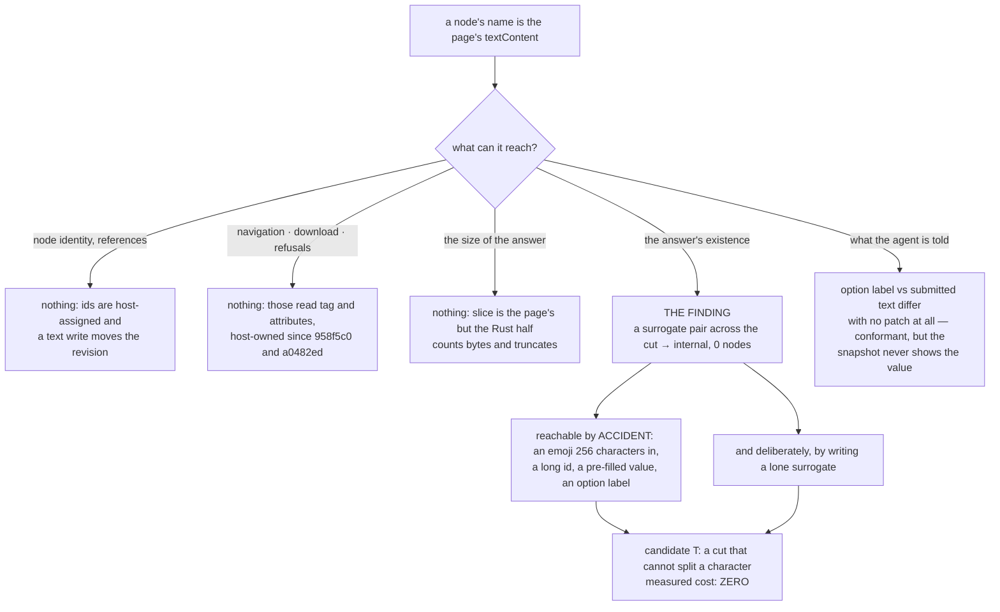

# The C class: what a page's own text reaches

Design-only, read-only. Nothing was implemented in the committed tree, no court
was frozen, no pin was moved, no capture added, no handle widened, no bound
changed, nothing mixed with slimming or H2, no visual run, no soak, nothing
downloaded. One candidate was built to price it, measured on both allocators,
and discarded; §7 proves the tree is back where it started. Receipt:
`evidence/native-dom-control-0.0.2-text-answer.json`.

Every fail-open named in `uncaptured-intrinsic-audit-0.0.1.md` §3.1 is now
closed. This audit takes the one class that ruling left open: **a node's name in
the agent's snapshot comes from the page's `textContent`.** That is obviously
page-controlled content. The question is whether it is *only* that.

## 1. The host path, read from the source

| what | where | built from |
| --- | --- | --- |
| `textContent` | `dom_shim_base.js:118` | `childNodes.map(...).join("")` |
| a node's reported `name` | `snapshot_script`, `main.rs` | `(el.textContent \|\| "").trim()` then `.slice(0, 256)` |
| a textarea's `value` | `dom_shim_base.js:338` | `this.textContent` |
| an option's `label` | `dom_shim_base.js:385` | `getAttribute("label") ?? textContent` |
| an option's **submitted** value | `SERIALIZE_JS`, `main.rs` | `o.getAttribute("value") ?? (o.textContent \|\| "").trim()` |
| `dom_id`, `control_name`, `group`, `value`, option `label` | `snapshot_script` | `String(…).slice(0, 64)` or `(0, 256)` |

`map`, `join`, `trim` and `slice` on that path are all the page's, and so is the
text itself.

## 2. What page text cannot reach — measured, not argued

Seven arms, each a page that writes its own text or replaces one method on the
path, with honest controls in the same document.

- **Node identity.** A reference's `node` id is positional and assigned by the
  host from its own list; text never enters it. No arm changed a node id, and no
  arm made an act land on a different element.
- **An act's reference.** Writing text is a DOM mutation: the revision moves
  0 → 2 on every arm that writes, and a reference taken before is answered
  `stale_revision`. Measured on all seven arms.
- **Navigation and downloads.** The link act navigates to `/landed.html` on
  every arm, and on **no arm did any other request reach the server**. No
  scheme, origin, method, target or download decision reads text.
- **Typed refusals.** No arm changed one. The activation vocabulary is derived
  from the tag and the attributes, both host-owned since `958f5c0` and
  `a0482ed`.
- **The size of the answer.** `String.prototype.slice` is the page's, so the
  256-character cut is the page's — and it does not matter: with `slice`
  replaced by the identity the snapshot came back **`truncated: true`, one node,
  411 bytes**, because the Rust half counts each node's serialised bytes and
  stops at `max_bytes` (`main.rs:7029-7032`). The bound that matters is the
  host's.

So the class is what it was called: page-controlled content. With two
exceptions, and the first of them is not an attack at all.

## 3. The finding: a cut that splits a character loses the whole snapshot

`entry.name = name.slice(0, 256)` cuts **UTF-16 code units**. When the 256th
unit is the first half of a surrogate pair, the realm hands the host a lone
surrogate, `serde_json` refuses the string, and the host answers
`internal` — *"engine returned malformed snapshot JSON"* (`main.rs:4589`).

Measured on the shipped tree, each document on its own host:

| document | snapshot |
| --- | --- |
| plain text | ok |
| 200,000 plain characters | ok, name cut to 256 |
| 255 characters then an emoji — **the pair straddles the cut** | **`internal`, 0 nodes** |
| 254 characters then an emoji — the pair ends at the cut | ok |
| 300 characters then an emoji — the pair is past the cut | ok |
| an emoji straddling the 64-unit cut on a **`dom_id`** | **`internal`, 0 nodes** |
| an emoji straddling the 256-unit cut on an input **`value`** | **`internal`, 0 nodes** |
| an emoji straddling the 256-unit cut on an **option label** | **`internal`, 0 nodes** |

**No intrinsic is replaced in any of those.** This is ordinary content at an
unlucky offset: a paragraph with an emoji 256 characters in, a long id, a
pre-filled field. A legitimate page loses its entire snapshot, and the agent is
told `internal` rather than anything it can reason about — unlike the strict
parse, which answers `target_crashed` with `reason: "snapshot_schema"`.

A second route reaches the same crash deliberately: a page writing
`String.fromCharCode(0xD800)` into text. That one is self-inflicted and a page
can already deny itself a snapshot a dozen ways. The accidental route is the one
that matters, and it is the reason this is a defect rather than a curiosity.

**Classification: wrong-answer fail-closed, reachable by accident.** Nothing is
approved that should not be; the answer is simply lost, and lost with an untyped
diagnosis.

## 4. The second finding: the agent is shown a label and the host submits a text

`<option label="A">B</option>` with no `value` attribute. Measured, with no
patch of any kind:

- the snapshot's `options[].label` is **`A`** — what the agent sees;
- the submitted query carries **`B`** — the option's text.

The server confirmed it by marker: the label marker did not appear in the query
and the text marker did. **The snapshot never exposes the value that would be
submitted**, so an agent choosing option *n* by its label cannot know what the
host will put on the wire.

This is conformant: a browser does exactly the same, because `label` is the
display label and the submitted value falls back to the option's text. It grants
no capability — the page authors both strings. But it is the same *shape* as the
divergence the approval signature exists to prevent, arrived at through
spec-conformant HTML rather than through a defect, and an agent has no way to
see it. **Classification: intended behaviour, with a gap in what the agent is
told.** The remedy is an answer change, not a guard: report the value the host
would submit beside the label. That is a protocol question and is out of this
audit's scope.

A stateful replacement — a `join` that answers one string when the agent is told
and another when the host serialises — was tried and **did not** produce a
divergence in this shape: the submitted query carried the same marker as the
unpatched arm. Recorded as measured, not as cleared: a different stateful shape
was not searched for.

## 5. What the arms did to the answer, and nothing else

| arm | the agent's answer | anything else |
| --- | --- | --- |
| the page writes its own text | the name changes | nothing |
| `Array.prototype.join` constant | every name becomes the page's constant | nothing |
| `Array.prototype.map` empty | every name becomes empty | nothing |
| `String.prototype.slice` identity | one node, `truncated: true` — **the host's bound holds** | nothing |
| `String.prototype.trim` grows short strings | 0 nodes: the page broke its own selector path | nothing |
| a stateful `join` | a name that is not the element's text | nothing |

Every one of them is a page changing what a page's own document says. None
reached an act, a request, a refusal or a reference.

## 6. Tree DAG

```
a node's name comes from the page's textContent
├── can it reach node identity or an act's reference?
│   └── no — ids are positional and host-assigned, and a text write moves the
│       revision, so a reference taken before is stale (measured on all seven arms)
├── can it reach a navigation, a download, or a typed refusal?
│   └── no — those read the tag and the attributes, host-owned since 958f5c0 and a0482ed
│       └── and no arm caused any request the baseline did not
├── can it escape the size bound?
│   └── no — `slice` is the page's, but the Rust half counts bytes and truncates
│       (main.rs:7029) → truncated: true, one node, 411 bytes
├── can it lose the whole answer?          ← THE FINDING
│   ├── a surrogate pair straddling the 256-unit cut → internal, 0 nodes
│   │   └── ordinary content at an unlucky offset; also 64-unit dom_id, value, option label
│   └── a page writing a lone surrogate → same crash, self-inflicted
└── can what the agent is shown differ from what the host submits?
    └── yes, without any patch: option label vs option text — conformant HTML,
        and the snapshot never shows the value
```

## 7. Mermaid



## 8. The candidate, priced by an actual build

**T — a cut that cannot leave half a character.** `snapshot_script` gains a
`cut(raw, n)` built from `.length`, index reads and `+=`: it stops rather than
splitting a pair at the boundary, and replaces an unpaired surrogate anywhere
with U+FFFD. It replaces all six `.slice(0, n)` calls on page-derived strings —
`name`, `value`, `dom_id`, `control_name`, `group` and an option's `label`. The
technique is the one already ruled in for `urlOf` and the approval signature, so
the cut also stops being the page's.

Built as `6f44390e`, measured, and discarded.

| measurement | shipped `cc8ebfa4` | candidate `6f44390e` | delta |
| --- | ---: | ---: | ---: |
| `dom_shim_base.js` | 33,886 | 33,886 | **0** |
| `dom_shim_main.js` | 26,485 | 26,485 | **0** |
| child-frame M1, system | 238,554 | 238,554 | **0** |
| child-frame M2, system | 1,668,444 | 1,668,444 | **0** |
| child-frame M1, arena | 230,586 | 230,586 | **0** |
| child-frame M2, arena | 1,614,092 | 1,614,092 | **0** |

**Every measured cost is zero on both allocators**, because the edit lives
entirely in a host script, which is compiled at each evaluation and is not
resident per realm. Nothing was extrapolated: this is one build, one probe run
and one child-frame run on both arms.

It closes **both** routes: all eight cut documents return a snapshot, and the
deliberately written lone surrogate is reported as U+FFFD instead of losing the
answer. And it moves nothing else — measured on the candidate: attribute-fact
154/154, element-tag 52/52, signature-integrity 34/34, property-shape 22/22,
registry-brand 15/15, snapshot-schema 13/13, form 179/179, frame-action 182/182,
downloads 21/21, element-api 28/28, dataset 15/15, child-frame 82/82, and 58
tests.

**T1, a cut-only variant** that fixes the boundary and leaves a deliberately
written lone surrogate alone, is strictly smaller. It is **not priced**: it was
not built, and carrying T's numbers across would be an extrapolation. T's price
is already zero, so there is nothing to save.

**The builds are gone.** `git checkout -- src/` restored the tree and the binary
was rebuilt to `cc8ebfa4a4dc710a`, with the shims at 33,886 and 26,485 bytes.

## 9. Loss matrix

| option | closes | leaves open | measured cost | risk |
| --- | --- | --- | --- | --- |
| **Accept** | nothing | a legitimate page loses its whole snapshot to an emoji at an unlucky offset, with an untyped `internal` | zero | the failure is silent to the agent and looks like a host fault rather than a page one |
| **T: the surrogate-safe, page-unreachable cut** | both crash routes, and the cut stops being the page's | the label/value gap in §4 | **zero on every measure, both allocators** | it edits `snapshot_script`, which every snapshot runs; the settled courts all hold on the candidate |
| **T1: boundary only** | the accidental route | the deliberate one, and the cut stays the page's | not priced, not built | smaller than a change that already costs nothing |
| **Type the failure** — answer `target_crashed` with a reason instead of `internal` | the diagnosis, not the defect | the defect | not priced | strictly worse than T alone: it makes a loss legible instead of not losing |
| **Report the submitted value beside the label** (§4) | the agent's blind spot on selects | nothing here | not priced; it is a protocol/answer change | belongs to whoever owns the agent contract, in its own round |

The reading: **T is the whole of what this audit recommends.** It closes a
defect that a normal page can hit by accident, at a measured cost of zero, with
every settled court unmoved. §4 is a separate question about what the snapshot
should say, not about what the host should guard.

## 10. Dependencies

- **`snapshot-schema-court.py`** (13/13 on the candidate) exercises the parse
  that currently rejects the lone surrogate. A T-shaped change makes that
  rejection unreachable from ordinary content; the court's criteria do not move.
- **`attribute-fact-court.py`, `element-tag-court.py`** — both read node roles
  and names out of the same script; both 154/154 and 52/52 on the candidate.
- **The cost guards** — `element-tag`'s rebased equalities and
  `signature-integrity`'s base-byte pin — **do not move**, because the edit adds
  no base-shim bytes. That is worth stating: this is the first candidate in this
  line that needs no re-freeze at all.
- **No dependency on H2 or slimming**, and none on any capture: `cut` consults
  no prototype method.

## 11. Safe failures

- A cut that would split a pair stops one unit early: the name is one character
  shorter, never half a character. Shorter is the direction that loses nothing
  the agent can act on, since names are not references.
- An unpaired surrogate becomes U+FFFD, which is what every other text pipeline
  does with one; the answer stays well-formed.
- If `cut` were somehow to return an empty string the node's name is empty,
  which is a node the agent can still reference and act on — names are not
  identity.
- Leaving it open fails by losing the whole snapshot, which is fail-closed but
  untyped, and is what makes it worth fixing.

## 12. Falsifiable court draft

Not frozen. **A — the answer survives its own text (8).** Each of the eight
documents in §3 returns a snapshot, on its own host: plain, 200,000 characters,
the pair straddling the 256-unit cut, the pair ending at it, the pair past it,
the pair across a 64-unit `dom_id`, across a 256-unit `value`, and across an
option label. Anti-vacuity: the plain document must return exactly one node with
a five-character name, so a court that returned nothing would fail.

**B — a written lone surrogate does not lose the answer (2).** A page writing
`String.fromCharCode(0xD800)` gets a snapshot whose name is the same length as
the pair's, and a page writing a well-formed pair is unchanged.

**C — the bound still binds (2).** With `String.prototype.slice` replaced by the
identity, the snapshot is still bounded — one node, `truncated: true` — and the
names produced by `cut` are never longer than their limit.

**D — nothing else moved (4).** No arm causes a request the unpatched arm does
not; a text write still moves the revision and still makes an earlier reference
`stale_revision`; the link still navigates; and the settled courts' numbers are
unchanged.

Every criterion must be run against the pre-change binary first and must fail
there for its own reason.

## 13. Non-goals, and what this does not settle

No implementation in the committed tree, no court frozen, no pin re-frozen, no
capture added, no handle widened, no bound changed, nothing mixed with slimming
or H2, no visual run, no soak, nothing downloaded, and no settled court or
historical receipt touched — the candidate's runs are scratch and are recorded
in this audit's own receipt, not written over any round's evidence.

- §4's label/value gap is **named and not solved**: it is an answer-shape
  question for the agent contract, and it is conformant behaviour rather than a
  defect.
- `trim` on the name path is still the page's. It changes only the name, and the
  arm that abused it produced a page that broke its own selector path — a
  self-inflicted denial. Not pursued.
- The stateful-replacement question is answered only for the shape tried. A
  different stateful shape was not searched for, and the audit does not claim
  there is none.
- The probe uses one document per arm on this machine; the cut behaviour is a
  property of the code, but the byte and owner-byte numbers are that fixture's.
