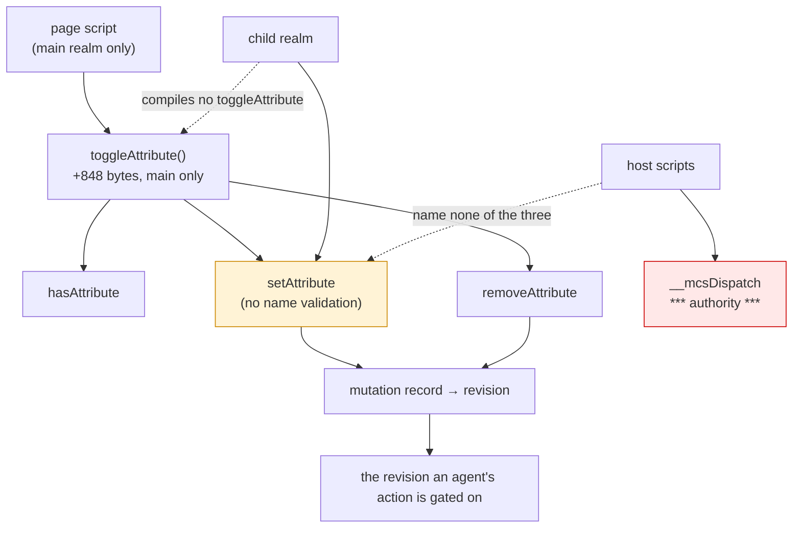

# `toggleAttribute`, and the name nobody validates

Design and read-only measurement only. No product code, no court frozen, no
handle widening, no navigation soak, no surface path. The cost variant was
built in a throwaway worktree that has been removed. Measured on `2b69573` /
binary `1e472770aa50…`.


## 1. What the door says today

| probe | answer |
| --- | --- |
| `element.toggleAttribute` | **`undefined`** |
| `hasAttribute`, `setAttribute`, `removeAttribute` | present |
| `setAttribute("a b", "1")` | **accepted**, and readable back |
| `setAttribute("", "1")` | **accepted** |
| `setAttribute("DataX", …)` then `hasAttribute("datax")` / `("DataX")` / `("DATAX")` | `true` for all three |
| `setAttribute("flag", "")` | stored as `""` |
| `classList.add("")` / `classList.add("a b")` | throw, named `SyntaxError` and `InvalidCharacterError` |
| the page's own three-line toggle | works |

*A probe limitation, not a finding:* two revision probes threw, because
`window.__mcs` is installed after a document's own inline scripts run, so a
page script cannot read the revision counter at parse time. The revision
behaviour of a toggle is measurable from the outside instead, through
`target.inspect`, and the court a slice would freeze should do it that way.


## 2. The compatibility case, which is thin, and the finding underneath it

`toggleAttribute` is three lines a page can write, and this host's
`hasAttribute`/`setAttribute`/`removeAttribute` are all present, so the value
is the same one `closest` had: a page that calls the standard method does not
die. It is the thinnest of the three compatibility candidates so far.

The finding underneath it is not thin. **This host validates no attribute
name at all.** `setAttribute("a b", "1")` is accepted here and throws
`InvalidCharacterError` in every browser; `setAttribute("", "1")` likewise.
That is the third divergence of this shape found by probing rather than
reading — after `querySelectorAll`'s plain array and `attributes`' plain
objects — and it is the one with the sharpest edge, because a page can create
an attribute no parser would produce and no browser would keep.

Note the inconsistency it creates inside this host: `classList` **does**
validate its tokens and throws with the standard's names, while
`setAttribute` next to it accepts anything.


## 3. The error boundary, which is the ruling this audit exists for

In the standard `toggleAttribute` validates the name and throws
`InvalidCharacterError` before touching anything. Three ways to go:

| option | what a page sees | cost | what it says about the host |
| --- | --- | --- | --- |
| **A. Validate in `toggleAttribute` only** | `toggleAttribute("a b")` throws, `setAttribute("a b")` still works | a few bytes of main | two neighbouring methods disagree about what a name is |
| **B. Do not validate** | both accept anything | the measured 1,696 bytes below, and nothing more | consistent with this host, divergent from the standard, recorded as a loss |
| **C. Validate in `setAttribute` too** | both throw, as a browser does | base growth, and it changes behaviour every existing fixture and court has relied on | the honest fix, and out of this slice's scope |

I lean to **B now and C as its own candidate**, beside the selector engine's
error name, which is the same kind of debt: this host names errors correctly
where it validates at all, and does not validate where the base never did. A
slice that adds validation should add it in the base, once, for every path,
with its own court — not smuggled in behind a three-line method.


## 4. Dependencies and cost

Built in the main extension from `hasAttribute`, `setAttribute` and
`removeAttribute`, all staying in the base: no handle widening, no base
growth, nothing a child compiles, no authority, and no host script names any
of the three.

| | current `2b69573` | with `toggleAttribute` |
| --- | ---: | ---: |
| M1 (system) | 224,458 | **224,458** — unchanged |
| main-only slack | 32,720 | **33,568** |

**848 bytes of main, nothing per child.**

Its effect on the revision follows the members it calls: adding or removing
writes the attribute and moves the revision once; a toggle whose `force`
matches the current state writes nothing and moves nothing, which is the same
rule `classList` was ruled on.


## 5. The tree

```
Should a page's attribute toggle work, and what is a name?
├── A. The method (owner: this audit)
│   invariant: toggleAttribute(name, force) adds with an empty value, removes, and returns whether the attribute is present afterwards
│   evidence: the court a slice would freeze; §1's probe of the members it calls
│   safe failure: absent, as today — the page's own call throws
│   dependency: hasAttribute, setAttribute, removeAttribute, all in the base
│   non-goal: namespaces, Attr nodes, or any validation the base does not do
├── B. The revision (owner: the base's setAttribute and removeAttribute)
│   invariant: a toggle that changes the attribute moves the revision once; one that does not, does not
│   evidence: measurable through target.inspect from outside, not from page script (§1)
│   safe failure: —
│   dependency: the mutation record the base already writes
│   non-goal: a new mutation kind
└── C. The name (owner: nobody, today — §2)
    invariant: whatever this host accepts as an attribute name is written down
    evidence: §1's accepted "a b" and ""
    safe failure: keep accepting, and record it
    dependency: the base's setAttribute
    non-goal: fixing validation inside a three-line compatibility method
```


## 6. The loss matrix

| what a page may expect | what it would get | class |
| --- | --- | --- |
| `toggleAttribute("hidden")` adding with an empty value and returning `true` | exactly that | in scope |
| `toggleAttribute(name, true/false)` forcing one way | exactly that | in scope |
| `InvalidCharacterError` on `toggleAttribute("a b")` | **nothing thrown**, under option B | **loss, and new** |
| the same on `setAttribute("a b")` | nothing thrown, today | **loss, newly written down** |
| namespaced attributes | none exist here | hard loss |
| `Attr` nodes from any of it | plain values | already recorded |
| case sensitivity | names lowercase on the way in, matching HTML | matches |


## 7. Where it sits




## 8. Boundaries and assumptions

- Nothing here is reachable in a child realm, and no host script names the
  three members it is built from.
- The revision is the one thing a toggle touches that the host cares about,
  and it touches it exactly as `setAttribute` and `removeAttribute` already
  do — through the mutation record, not around it.
- The frozen floors and the frozen main slack are the gates; this candidate
  moves only the slack, by 848 bytes.
- One court run per variant, one machine, scratch build removed.


## 9. What I need ruled

1. **Whether to add it**, at 848 bytes of main and nothing per child, for the
   thinnest compatibility case of the three so far.
2. **The error boundary** (§3): B — do not validate, record the loss — or A,
   which makes two neighbouring methods disagree about what a name is. I lean
   B.
3. **Whether attribute-name validation becomes its own base candidate**,
   beside the selector engine's error name. Both are the same debt: this host
   names errors correctly where it validates, and does not validate where the
   base never did. Recording it costs nothing now and stops it being
   rediscovered by the next audit.


## 10. The rulings

**10.1 `toggleAttribute` is accepted** as a compatibility fix: 848 bytes of
main, nothing per child, no base growth, no handle widening.

**10.2 The revision follows the members it calls.** A toggle that changes the
attribute moves it once, through `setAttribute` or `removeAttribute`; a toggle
whose `force` matches the current state writes nothing and moves nothing.

**10.3 Error boundary B.** This slice validates no attribute name, because
`setAttribute` and `removeAttribute` beside it do not, and a method that
disagreed with its neighbours about what a name is would be worse than either.
The divergence — `setAttribute("a b", …)` and `setAttribute("", …)` accepted
where a browser throws `InvalidCharacterError` — is recorded as its **own base
candidate**, beside the selector engine's error name.

**10.4 The court reads the revision from outside.** `window.__mcs` is
installed after a document's inline scripts, so a page cannot read the counter
at parse time; the criteria compare `target.inspect`'s revision across
boundaries instead, which measures the same thing without the timing trap.

**10.5 The criteria join `element-view-court.py`**: `force` true and false,
the attribute present and absent, the return value in each case, the revision
moving once and not at all, the child divergence, and owner release.
`cloneNode`, the selector engine's error name, C2b and `EventTarget` stand as
ruled.
