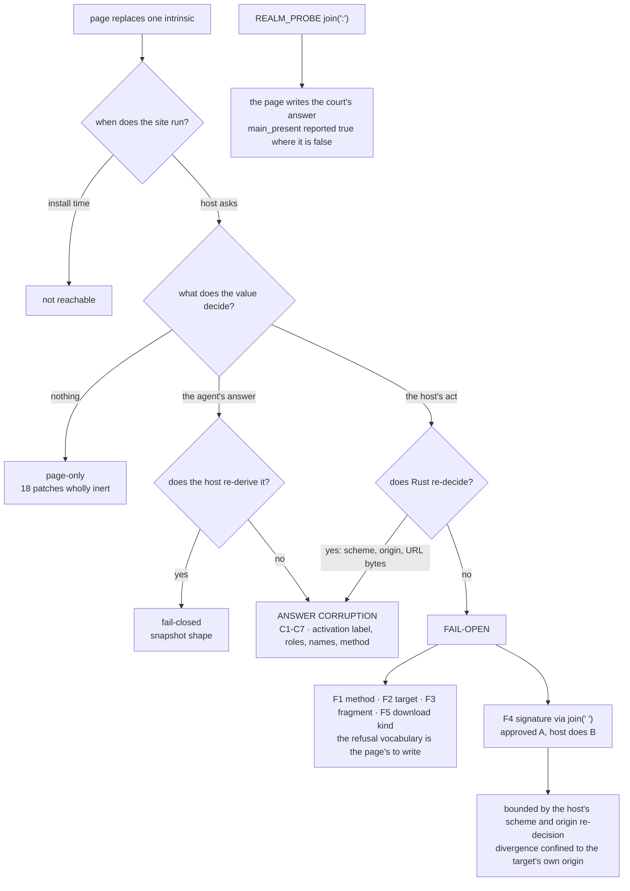

# The uncaptured intrinsic call sites: what page ownership actually buys

Design-only, read-only. Nothing was implemented, no court was frozen, no
handle, base or bound moved, and nothing here is mixed with byte slimming.
Every measurement is against the built binary `ba46420b…` at `ed636bf`,
through hermetic loopback fixtures written in this round; nothing was
downloaded and no window, surface or soak was started.

`intrinsic-hardening-h2-audit-0.0.1.md` §1 split the shims' intrinsic surface
into the calls that can be routed through a capture the base already holds and
the calls that cannot — 85 and **71** under its taxonomy — and closed by
naming the second half as the open question, `toLowerCase` above all. H1 then
hardened the one intrinsic that carried the host's answers (`JSON.stringify`)
and left the rest. This round asks the second half the question with an
answer: **for each site the page owns, what changes when the page replaces it
before the host looks?**

The answer is not uniform, and the interesting part is not `toLowerCase`.

## 1. The surface as it is today

Direct call sites of a page-replaceable method inside the three JavaScript
bodies — `dom_shim_base.js`, `dom_shim_main.js`, and the raw-string host
scripts in `main.rs` — counting only intrinsics the base does **not** already
hold a capture for (`push`, `indexOf`, `splice`, `slice`, `JSON.stringify`
excluded, and `Object.defineProperty` excluded because every one of its uses
runs at install time, before any page script exists):

| owner | sites |
| --- | ---: |
| `dom_shim_base.js` | 41 |
| `dom_shim_main.js` | 27 |
| `SERIALIZE_JS` (`main.rs:500`) | 16 |
| `snapshot_script` (`main.rs:639`) | 16 |
| `ACTIVATION_JS` (`main.rs:566`) | 10 |
| `form_action_script` (`main.rs:892`) | 5 |
| `act_script` (`main.rs:1063`) | 2 |
| `microbench_script` (lab arm only) | 2 |
| `download_probe_script` (`main.rs:762`) | 1 |
| `REALM_PROBE_JS` (`main.rs:237`) | 1 |
| **total** | **121** |

By method: `toLowerCase` 28, `test` 15, `trim` 10, `map` 8, `includes` 7,
`filter` 6, `join` 5, `replace` 5, `concat` 4, and a tail of twelve more.

**Reconciliation with the 71.** H2 counted 71 (base 33, main 19, host scripts
19) over a narrower method list — it did not count `test`, `exec`, `find`,
`replace`, `forEach`, `repeat`, `toString`, `Math.*` or `charCodeAt`. Dropping
those same names from today's list gives 88, and the growth over 71 is
entirely in the host scripts, which went from 19 sites to 53 because
`download_probe_script`, `form_action_script` and `act_script` landed after H2
was written. Two things follow, and both are worth saying plainly: **the
uncaptured surface grows every time a host script is added**, and H2's headline
number is already out of date. The count that matters is not the total anyway —
it is how many sites sit on a path that decides something, and that is
answered below.

One correction to my own first inventory, recorded because it changes a
number: scanning `main.rs` line-wise counted 67 host-script sites, because
`main.rs` is mostly Rust and Rust's `.trim()`, `.map()` and `.join()` are not
the page's to replace. The 53 above counts only text inside the raw string
literals. The same mistake in the other direction would have inflated every
conclusion here.

## 2. Method

`uncaptured-intrinsic-probe.py` is a **probe, not a court**: it scores nothing
and freezes nothing. It runs the real host against one fixed document and one
fixed sequence — open, snapshot, act on each link, download the link, submit
each form, snapshot again — once per patch, and records the outcome of every
step. A patch whose whole column equals the unpatched baseline changed nothing
the host decides with. Receipt:
`evidence/native-dom-control-0.0.2-uncaptured-intrinsic.json`.

Two patch families, because they answer different questions:

- **Blanket** (34 rows): the intrinsic is replaced outright — a constant, an
  identity, an empty array. This is the strongest replacement a page can make
  and the weakest attack, because it also breaks the page's own document.
- **Selective** (9 rows): the intrinsic lies about exactly one comparison and
  behaves normally otherwise. This is what a page actually trying to move a
  host decision would write, and it is where every fail-open in this audit was
  found. **A blanket-only probe would have concluded that nothing is
  reachable**, which is the shape of a vacuous pass and is why both families
  exist.

Two further scenarios, each aimed at one mechanism rather than one intrinsic:
the **interlock** (a page that moves an approved link's `href` from inside its
own `focus` handler, which runs in the window the act script opens between the
two derivations of the approval signature), and the **court probe**
(`--court-realm-probe` with a private court file, asking whether the page can
write the court's own answer).

"Fail-open" here means one thing only: **the host performed an act that its own
rule refuses, or performed a different act than the one the agent approved.**
It does not mean the page changed its own document; a page is entitled to do
that, and confusing the two is how this class gets over-reported.

## 3. What the measurements say

### 3.1 Fail-open — the host acted where its own rule refuses

| # | site | file | the page replaces | measured |
| --- | --- | --- | --- | --- |
| F1 | `methodOf` `.trim().toLowerCase()` | `main.rs:591` | `toLowerCase` or `trim`, for the receiver `"post"` only | a `method="post"` form is **submitted as a GET**: `unsupported_capability/form_method_unsupported` → `applied: true`, and the server received the request |
| F2 | `targetOf` `.trim().toLowerCase()` | `main.rs:572` | `toLowerCase`, for the receiver `"somewhere"` only | a `target="somewhere"` link is **activated in the current frame**: `unsupported_capability/target_named` → `applied: true` |
| F3 | `schemeDecision` `value.startsWith("#")` | `main.rs:582` | `startsWith`, for the argument `"#"` only | a `href="#section"` link **navigates**: `unsupported_capability/fragment_unsupported` → `applied: true`, and the revision advances a second time |
| F4 | `__mcsPreflight` `[…].join(" ")` | `main.rs:558` | `join`, for a four-element space-joined array only | **the approval stops binding.** Baseline: the page's `focus` handler moves the href, the re-derived signature differs, and the act is refused `preflight_mismatch` with **nothing fetched**. Patched: the act is applied and the host fetches `/moved.html` — a URL the agent never approved |
| F5 | `download_probe_script` `el.tagName.toLowerCase() !== "a"` | `main.rs:775`, with `role()` at `main.rs:651` | `toLowerCase`, for the receiver `"DIV"` only | **a `<div href=… download=…>` is downloaded.** Baseline: the div is not a node at all, and a paragraph that *is* a node is refused `unsupported_capability/not_a_link`. Patched: the div appears in the snapshot as a `link`, `target.act` with `kind: "download"` returns its bytes, and the server was fetched |

F1 through F3 and F5 are integrity defects of the **refusal vocabulary**, not
escalations of capability: the page could have written `method="get"`, no
`target`, a real path and an ordinary `<a>` in its own markup and got the same
navigation and the same download honestly. What it gains is that the closed
vocabulary the agent plans against — `form_method_unsupported`,
`target_named`, `fragment_unsupported`, `not_a_link` — is the page's to write.
An agent that trusts a refusal is trusting the page. The download sink's real
guards are untouched by F5: the permission is still checked at use, and the
per-profile download count and byte budgets are still the host's.

**F4 is different in kind and is the finding of this audit.** The two-phase
interlock exists precisely so that what the agent approved and what the host
does cannot diverge; it is the one thing on this list a page cannot achieve
honestly. One uncaptured `.join(" ")` is enough to defeat it, and the
measurement is a clean pair: the same page, the same handler, the same act —
refused and silent without the patch, applied and fetched with it. Its blast
radius is bounded by the host half, which still resolves the moved address,
still refuses a non-`http(s)` scheme and still enforces the origin, so the
divergence is confined to addresses inside the target's own origin. Inside that
origin it is total.

### 3.2 Answer corruption — the agent is misled, the host does not act

| # | site | file | measured |
| --- | --- | --- | --- |
| C1 | `schemeDecision` `/^https?$/i.test(…)` | `main.rs:584` | the snapshot advertises `activation: "allowed"` for a `javascript:` link. The act is still refused |
| C2 | `schemeDecision` `.exec(…)` | `main.rs:583` | same, by removing the scheme match instead of accepting it |
| C3 | `urlOf` `.replace(/^[ \t\n\r\f]+…/)` | `main.rs:579` | same, for `href="   javascript:…"`: the strip is skipped, the regex no longer matches at position 0, and the realm answers `allowed` |
| C4 | snapshot `entry.method` `.toLowerCase()` | `main.rs:702` | the agent is told a `method="post"` form is `method: "get"` |
| C5 | `role()` `/^h[1-6]$/.test` and the type regexes | `main.rs:649`+ | with `test` always true the snapshot returns **17 nodes where the document has 13, every one a `heading`**, none with an activation and none with a value; with `test` always false it returns 11 and the textboxes are gone |
| C6 | `entry.name`, via `textContent`'s `map`/`join` | `dom_shim_base.js:115` | every node's `name` becomes a string of the page's choosing (`"JOINED"` in the probe) |
| C7 | `entry.name` / `dom_id` `.slice(0, 256)` | `main.rs:701`+ | every name and every `dom_id` becomes empty, so nothing can be referenced by id |

C1 through C3 are the cases where **host-side revalidation already saves the
act**: `main.rs:7280` re-resolves the preflight's href in Rust and refuses any
scheme that is not `http` or `https`, then bounds the URL and checks the
origin. The realm said `allowed` and the host said no. That is the pattern the
rest of this list lacks — and note what it costs the agent even so: the
snapshot's `activation` field, which exists so an agent can *see a refusal
coming*, told it the opposite.

C4 through C7 corrupt what the agent is told about a document. None of them
lets the host do anything, and a page can already write whatever text and
markup it likes, so the ceiling on this class is low — but C4 is worth
separating, because it is the snapshot half of F1 and the two together let a
page show the agent a GET form, have the agent approve a GET, and have the host
submit a form the page declared POST.

### 3.3 Fail-closed and inert — the rest

Every blanket replacement of the `toLowerCase` family collapses the agent's
snapshot to **0 nodes**, and the chain is worth recording because it is not the
obvious one: the snapshot's `role()` lowercases the tag, but `getAttribute` and
`hasAttribute` (`dom_shim_base.js:319-320`) lowercase the *attribute name*, so
every attribute lookup asks for the same attribute, `hasAttribute("href")`
answers false for every element, and no element gets a role. The same
zero-node or `internal` outcome follows from blanket `split`, `map`, `filter`,
`find`, `exec` and `push`. Four patches make `target.snapshot` fail with a bare
`internal`, which is a denial the page can already cause a dozen other ways,
but is not a *typed* refusal the way `target_crashed/snapshot_schema` is.

**Eighteen patches changed nothing at all**, including `JSON.stringify`
replaced with a forgery — that is H1 holding, re-measured — and
`Object.keys`, `Object.entries`, `Object.assign`, `JSON.parse`,
`Array.isArray`, `Array.from`, `Array.prototype.indexOf`, `includes`,
`concat`, `slice`, `splice`, `forEach`, `Math.min` and `charCodeAt`. Those sites
exist and were exercised; on this fixture none of them is on a path to
anything. That is a statement about this fixture, not a clearance — §12.

### 3.4 The court's own instrument

`REALM_PROBE_JS` answers the court's question about every realm as one string
built with `Array.prototype.join(":")` (`main.rs:246`), and `main.rs:4220`
splits that string back into seven booleans. The page owns `join`.

Measured: a page whose `join` returns `"true:false:true:true:true:true:true"`
for the separator `":"` produces exactly that vector in `memory.report`'s
`owners.realm_probe` — `main_present` reported **true** where the truth,
measured on the same fixture without the patch, is **false**. The page wrote
the court's answer.

The parse defaults are conservative for an eval *failure*
(`unwrap_or("true:true:false:false")`, `unwrap_or(true)` for the two internals
fields), but a well-formed lie is not a failure and never reaches them. This
contradicts the invariant `realm-probe-audit-0.0.1.md` was written to
establish — that the court's own diagnostic must not be blindable — and it
does so through the one intrinsic that audit did not look at. It is court-only
(`--court-realm-probe` is refused without a private court file), so no agent
answer depends on it; what depends on it is the evidence.

## 4. Where the host already revalidates, and where it does not

| decision | realm decides | host re-decides | verdict |
| --- | --- | --- | --- |
| scheme (`http`/`https`) | `schemeDecision` | **yes**, `main.rs:7280` | corruption only |
| origin of the activation | `targetOf` shape | **yes**, same block | corruption only |
| URL byte bound | — | **yes**, `MAX_URL_BYTES` | not reachable |
| submitted URL byte bound | — | **yes**, `main.rs:7415` | not reachable |
| form **method** | `methodOf` | **no** | **fail-open (F1)** |
| link/form **target** | `targetOf` | **no** | **fail-open (F2)** |
| **fragment** activation | `schemeDecision` | **no** | **fail-open (F3)** |
| approval **signature** | `__mcsPreflight` | **no** (host stores, realm compares) | **fail-open (F4)** |
| node **kind** for download | `download_probe_script` | **no** — see the correction below | **fail-open (F5)** |
| the snapshot's own **shape** | — | **yes**, strict parse → `target_crashed/snapshot_schema` | fail-closed |

**A correction to the H1 record.** `intrinsic-hardening-audit-0.0.1.md` §3
concluded that a page replacing an intrinsic "cannot flip an activation
refusal, because the host re-checks the node kind itself", and
`host-answer-court.py`'s activation group was frozen on that reading. Read at
`main.rs:7602-7604`, the host does not re-check the kind: it refuses `not_a_link`
only when the *realm* declined to supply an `href`, and the realm decides that
with `el.tagName.toLowerCase()`. Under `JSON.stringify` replacement — the only
patch H1 tried — the realm still answered that question honestly, so the
conclusion held for the experiment and was over-generalised into a property of
the host. F5 is the counter-example. Nothing frozen has to move: the H1
court's criteria still pass and still measure what they measured. What has to
move is the sentence.

The pattern is exact and worth stating as a rule rather than a list: **every
decision the Rust half re-makes for itself survives page ownership, and every
decision it takes on the realm's word does not.** No capture, in any quantity,
changes that; a capture only makes the realm's word harder to forge from
inside the same realm.

## 5. Tree DAG

```
uncaptured intrinsic call site (121)
├── runs at install time only (Object.defineProperty, the base's own setup)
│   └── not reachable — no page script exists yet [excluded from the 121]
└── runs when the host asks a question
    ├── the value never leaves the realm and decides nothing
    │   └── page-only: the page changes its own document (18 of 43 patches wholly inert)
    ├── the value reaches the agent
    │   ├── the host re-derives it → fail-closed (the snapshot's own shape)
    │   └── the host relays it → ANSWER CORRUPTION (C1–C7)
    │       └── with a host-side re-decision behind it → act still refused (C1–C3)
    └── the value decides what the host does
        ├── the host re-decides in Rust → corruption only (scheme, origin, bounds)
        └── the host takes the realm's word → FAIL-OPEN
            ├── a refusal the page could have avoided honestly
            │   (F1 method, F2 target, F3 fragment, F5 download kind)
            └── a divergence the page could NOT achieve honestly (F4 signature)  ← the finding
                └── bounded by the host's scheme/origin re-decision to the target's own origin
```

## 6. Mermaid



## 7. Loss matrix — what each remedy costs and what it leaves

Prices are **estimates** carried from `shim-reduction-audit-0.0.1.md`'s
measured per-construct table (own `defineProperty` 474 bytes, closure 502,
routing a call through a capture 48.6). They are not measurements of these
changes. **The C1 extrapolation error in that same audit is the reason no
remedy below may be frozen on an estimate**: each one is measured in its own
round or not adopted.

| remedy | closes | leaves open | estimated cost | risk |
| --- | --- | --- | --- | --- |
| R1: build the approval signature by concatenation with a literal separator, no `join` | **F4** | F1–F3, all corruption | a few source bytes; **no new capture, no new global**; host scripts are compiled per evaluation, so nothing per-realm | none identified — the signature never leaves the realm and its format is internal |
| R2: build `REALM_PROBE_JS`'s answer the same way | §3.4 | everything else | same | none; court-only surface |
| R3: `value[0] === "#"` instead of `.startsWith("#")` (string indexing is not replaceable) | **F3** | F1, F2, F4 | zero | none |
| R4: the realm returns **facts** (method, target value, tag name) and Rust decides | **F1, F2, F5**, and C4 with them | F3, F4, the corruption class | a wider realm→host answer; no protocol change (this is internal to the act) | the host must model what it re-decides; a partial version that re-decides method but not target closes half |
| R5: a captured `__mcsLower` on the `__mcsJson` pattern, routed at the 28 `toLowerCase` sites | F1, F2, F5, C4 — the whole `toLowerCase` class | F3, F4, `test`/`exec`/`replace`/`join` | **base grows**: one global on the measured `__mcsJson` shape plus 48.6 per routed call; the 9 base-shim sites are per-realm, the host-script sites are not | collides directly with the frozen base-byte work and with H3's declared-capture set and its reserved list; cannot be scoped without that round |
| R6: move the activation decision out of the realm entirely | F1–F5 and C1–C5 | nothing in this audit | large; a redesign of the preflight/act split | out of scope by a wide margin; named here because it is the structural answer, not because it is proposed |

The shape of the matrix is the ruling this audit would ask for. **R1, R2 and
R3 are free, targeted and independent**: between them they close the only
finding that is a real escalation (F4), the court-probe hole, and one of the
four vocabulary defects (F3), for no new capture and nothing per-realm. The
other three vocabulary defects need a decision moved, not an intrinsic
protected — which is R4. R5, the new capture, is what "harden the 71 sites"
sounds like it means; it is the most expensive option on the table and it
closes strictly less than R4 does.

## 8. Falsifiable court candidates

Drafted, not frozen. Each fails on today's binary and would pass on a repaired
one, and each is written so that it cannot pass vacuously.

1. **The approval binds.** A page moves an approved link's `href` from its own
   `focus` handler and replaces `Array.prototype.join`; the act is refused
   `preflight_mismatch` and the server sees **no request**. Anti-vacuity: the
   same court runs the unpatched arm and requires the refusal there too, and
   requires the *unmoved* link to navigate successfully, so a court that
   refuses everything fails.
2. **A declared POST stays refused.** A page replaces `toLowerCase`, then
   `trim`, selectively for the receiver `"post"`; `target.act` on the form is
   refused `form_method_unsupported` on both arms, and the snapshot reports
   `method: "post"`. Anti-vacuity: a GET form in the same document must still
   submit and be fetched.
3. **A named target stays refused.** As above for `"somewhere"` → `_self`,
   with an unnamed link that must still navigate.
4. **A fragment stays refused.** As above for `startsWith("#")`, with the
   revision required not to advance.
5. **The court's probe is the host's.** A page dictates a seven-field vector
   through `join(":")`; `owners.realm_probe` reports the same values as the
   unpatched arm. Anti-vacuity: the two arms must differ in the page's *own*
   observable behaviour, so the court proves the patch was installed.
6. **A non-link is not downloadable.** A page teaches `toLowerCase` that
   `"DIV"` is `"a"`; the `<div href=… download=…>` is either absent from the
   snapshot or refused `not_a_link`, and the server is never fetched.
   Anti-vacuity: the real `<a download>` in the same document must still
   deliver its bytes on both arms.
7. **The activation label is not the page's.** A page defeats
   `schemeDecision`; the snapshot's `activation` for a `javascript:` link is
   `scheme_unsupported`, not `allowed`. Anti-vacuity: a normal link in the same
   document must read `allowed`.

Criteria 2–4, 6 and 7 must each name the *element that still works*, because a
court whose every criterion is a refusal passes on a host that refuses
everything — the failure mode recorded three times in this line of work.

## 9. Dependencies

- **H3's declared-capture set and its reserved list** (`["arrayIndexOf"]`):
  R5, and only R5, adds a capture and therefore reopens that declaration and
  `capture-declaration-court.py`. R1–R4 add none and do not touch it.
- **The base byte budget** and `shim-footprint-court.py`: R5 only. R1, R2 and
  R3 change host-script text, which is compiled per evaluation and is not
  per-realm resident.
- **`probe-truthfulness-court.py`**: R2 changes what that court measures and
  would need its criteria re-read, though not loosened.
- **The strict snapshot parse** and `snapshot-schema-court.py`: unaffected —
  every corruption in §3.2 produces a *well-shaped* snapshot with wrong
  contents, which is exactly the case a schema check cannot catch. Saying so
  here prevents the mistake of pointing at the strict parse as coverage.
- **The registry brand**: unaffected and doing its job. The download probe's
  href cannot be moved between snapshot and act, because moving an attribute
  is a mutation and the branded counter advances. F5 does not go through that
  door — it changes what the realm *says the element is*, not what the element
  is — which is why the brand does not catch it.
- **`downloads-court.py` and `host-answer-court.py`**: work on the download
  probe lands in what those exercise, and the H1 sentence corrected in §4 is in
  the second one's preamble.
- **`form-court.py`, `navigation-court.py`, `page-navigation-court.py`**: any
  R1/R3/R4 change lands in the scripts these exercise, so they are the
  regression set for it.

## 10. Safe failures

- If R1 lands and the signature format changes, a stale or mismatched
  signature refuses the act (`preflight_mismatch`); it cannot approve one.
- If R3 lands and `value[0]` is undefined for an empty href, the comparison is
  false and the decision falls through to the scheme check, which refuses an
  unparseable address. The empty case is a refusal, not an allow.
- If R4 lands and the realm returns no `method` field, the host must treat the
  absence as **not `get`** and refuse. Defaulting to `get` there would
  reintroduce F1 through the back door, and it is the same defaulting mistake
  `snapshot-defaulting-audit-0.0.1.md` ruled on.
- If a page breaks the shims badly enough, the observed outcome is 0 nodes or
  `internal` — the agent gets nothing, which is the correct direction.

## 11. Non-goals for this round

No implementation. No court frozen. No new capture, no change to the declared
capture set or its reserved list, no change to any handle, base or bound, and
nothing mixed with byte slimming. No visual run, no navigation soak, no
Lightpanda download, no Servo crate fetch. No change to the protocol: every
remedy above is internal to the host and its scripts.

## 12. What this does not settle

- The probe uses one document. A site that this fixture never exercises is
  unclassified, not cleared — the 18 inert patches are inert **on this
  fixture**, and `dom_shim_main.js`'s 27 sites are barely touched by it because
  the fixture runs almost no page API.
- The selective family shows that blanket replacement understates the surface.
  It does not show that the nine selective patches written here are the
  strongest ones available; a tenth may exist for a site classified inert.
- F4's bound — "confined to the target's own origin" — is inferred from the
  host-side re-decision at `main.rs:7280` being on the path, and was measured
  only for the scheme half. The origin half was not separately falsified in
  this round.
- H2 is still not done on the evidence, and this audit does not do it: routing
  the 85 capturable sites is a different change from any remedy here.
